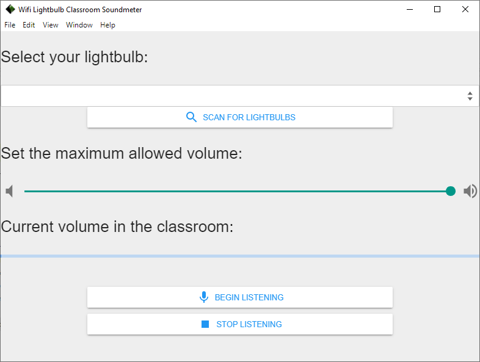

# Wifi Lightbulb Classroom Soundmeter

Changing the color of a Wi-Fi smart lightbulb when the sound level in a classroom changes for classroom management!

Set an upper bound on how loud you want your class to be. As they get closer to this threshold, the bulb turns increasingly red. If they're quiet? The bulb turns more and more green!

[Works with MagicHome brand smart lightbulbs, which you can buy here.](https://www.amazon.com/gp/product/B07SYX4T7M/ref=ppx_yo_dt_b_asin_title_o08_s00?ie=UTF8&psc=1)

# How to Install
Using the download links at the top of this page, download the zip file. Unzip it to a location on your computer. Open the folder and double-click the program.

# How to Use
1. Turn on your MagicLight smart lightbulb. Follow the manufacturer's instructions for connecting it to your classroom's WiFi.
2. Open the WiFi Lightbulb Classroom Soundmeter application you installed earlier.
3. Click 'Scan for Lightbulbs'. Click your lightbulb from the dropdown menu. If multiple lightbulbs appear, match the lightbulb ID in the dropdown menu to the one that appears in the MagicLight app for your lightbulb.
4. Click 'Begin Listening'. Your lightbulb will begin changing color from green to red as the room grows louder.
5. Adjust the maximum volume your students are allowed to be at to your preference using the slider.
6. Click 'Stop Listening' when you want the program to stop measuring the classroom volume.
